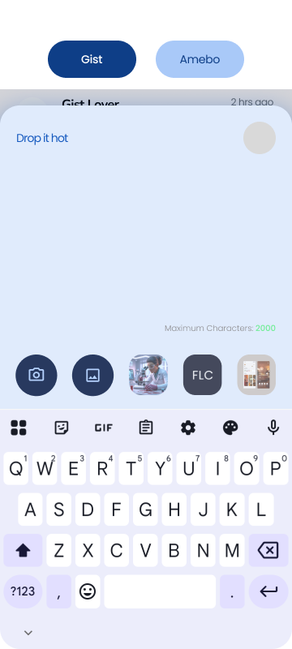
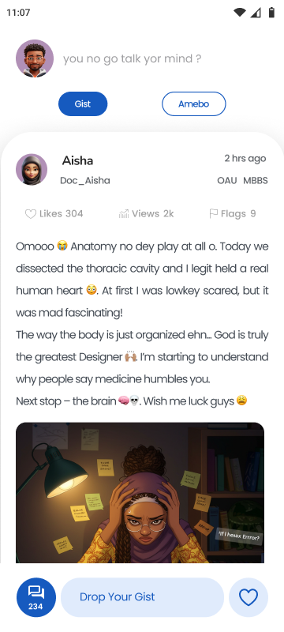
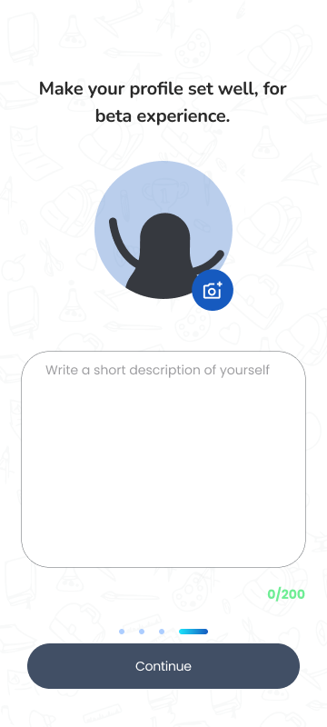

<!--  -->

#  Hey👋

## Meet the Chef

I build scalable systems and real-world products that solve problems and impact lives. Yeah, that’s basically it. It’s kind of cool, innit? That superpower of turning lines of jargon into something real — watching it come to life… and sometimes watching it <b>almost</b> break too lol. But yeah what doesnt kill a thing make it stronger rii?

I have 4 years of experience doing this — building mobile apps, websites, APIs… pretty much anything that runs on code. 

I high-key love drones and robots, so yeah, I’m diving into that space too.

I’m currently co-founding a startup called Kampos — a social media platform for Nigerian students in tertiary institutions

I love puppies and babies… well, I think we all do.

##  Pull up on me

  
   
 

Hit me up if you're building something crazy, hiring, or just want to vibe about tech

  <h1>Currently Cooking</h1>
  
<h2>Kampos</h2>  
<ul>
<li>
    Leading the development of <strong>Kampos</strong>, a campus engagement platform for Nigerian students, designing the system to support 1000+ active users with sub-200ms API response times.
  </li>

  <li>
    Designed and optimized PostgreSQL database architecture and implemented caching strategies that reduced database load by ~40%.
  </li>

  <li>
    Built core features including JWT-based authentication, dynamic content feeds, and background notification workers using message queues.
  </li>

  <li>
    Collaborated closely with product, design, and development teams to research user needs, define technical requirements, and architect a stable version of Kampos.
  </li>
</ul>

  
  
    
  

<h2>Chopie</h2>

A scalable food delivery platform backend built with Go, currently under active development. 
This project aims to replicate core features of popular food delivery services like Chowdeck, focusing on high performance, reliability, and clean code practices.

<ul>
   <li>
    Complete REST API with Gin framework following Clean Architecture principles
 </li>
<li>
   User authentication (JWT), restaurant & menu management, cart system, and order workflow
</li>

<li> Paystack payment integration, Redis caching, RabbitMQ background jobs, and full Docker setup</li>
</ul>

<a href="https://github.com/CookingApps/Chopie">Checkout Chopie's Readme</a>
 

# My Tools

### Languages

  

### Frontend

  

### Backend and database

  

### Tools and devops

  

## Vibe check

###  Top Languages

###  My Stats

###  Streaksss

###  Relax! It does not bite.

  <picture>
    <source media="(prefers-color-scheme: dark)" srcset="https://raw.githubusercontent.com/CookingApps/CookingApps/output/github-contribution-grid-snake-dark.svg">
    <source media="(prefers-color-scheme: light)" srcset="https://raw.githubusercontent.com/CookingApps/CookingApps/output/github-contribution-grid-snake.svg">
    
  </picture>

